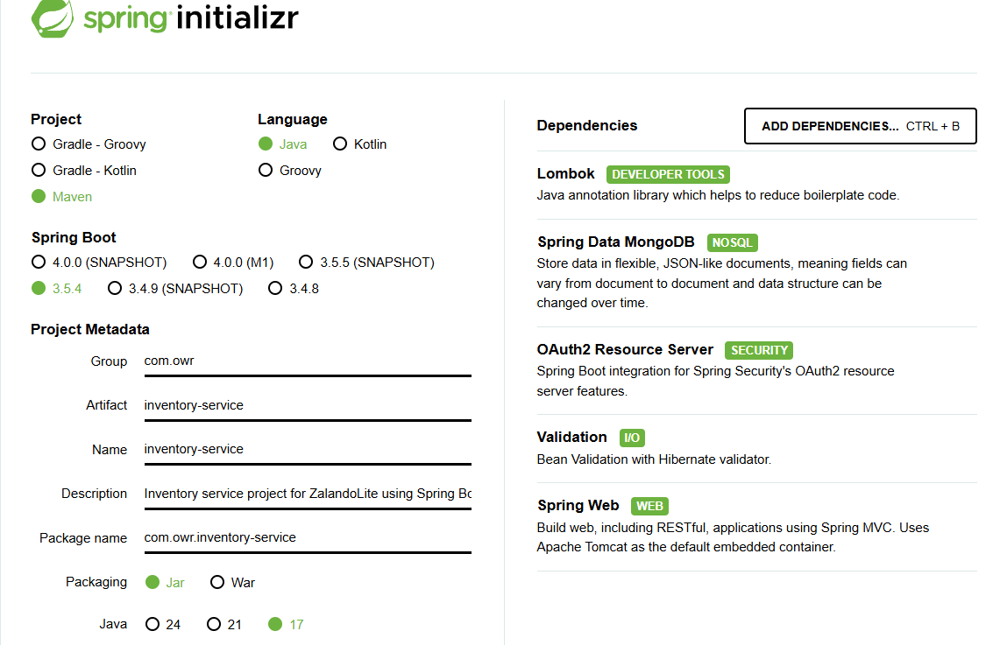

#  📦 ZalandoLite V2 -Inventory

---

###   🔗 [ZalandoLite V2  🍀 Overview Repository ](https://github.com/Ochwada/ZalandoLiteV2-MicroservicesArchitecture)
Microservices ⬇️ part of **ZalandoLite V2**
#### 🖇️ [Microservice 1: Authentication Service](https://github.com/Ochwada/ZalandoLiteV2-authentication)
#### 🖇️ [Microservice 2: Product Service](https://github.com/reyhanovelek/ZalandoLiteV2-Product)
#### 🖇️ [Microservice 3: Inventory Service](https://github.com/Ochwada/ZalandoLiteV2-inventory)

---
##  About Inventory Service
The **Inventory Service** is a core component of the ZalandoLite V2 backend system, responsible for managing and tracking 
product stock levels. It maintains an up-to-date record of inventory for each product and exposes a set of RESTful 
endpoints to enable the following operations:

- **Create Inventory Records**: Add initial stock levels when a new product is introduced. 
- **Update Inventory**: Modify stock quantities in response to orders, returns, or restocking. 
- **Retrieve Inventory Data**: Fetch current stock levels for real-time availability checks.

This service plays a critical role in enabling seamless interactions across the ecosystem, particularly by supporting
**real-time stock validation** for services like the **Product Service and Order Service**. By decoupling inventory 
logic into its own microservice, the system ensures scalability, separation of concerns, and efficient inventory 
control across the platform.
### Key Responsibilities
1. **Track stock per product**: Maintains quantity and stock status for each individual product. 
2. **Real-time stock visibility**: Enables other services (e.g., Product Service, Order Service) to query available inventory before placing or processing orders. 
3. **CRUD operations for inventory**: Allows the creation and updating of stock data.

#### Data Storage
MongoDB is the recommended database for this service, leveraging its flexible document-based structure to store stock 
entries per product, along with optional metadata like rack IDs or warehouse zones.

## Project spring initialization

### Dependencies
Including the common dependencies ([check here](https://github.com/Ochwada/ZalandoLiteV2-MicroservicesArchitecture)), 
some *Unique Dependencies* for this service are:

| Dependency Artifact                          | Purpose                                                                   |
|----------------------------------------------|---------------------------------------------------------------------------|
| `spring-boot-starter-data-mongodb`           | Enables integration with MongoDB, allowing data persistence and queries   |
| `spring-boot-starter-oauth2-resource-server` | Secures the service by validating and processing OAuth2 JWT access tokens |




## API Endpoints
| Method | Endpoint                     | Description                                 |
|--------|------------------------------|---------------------------------------------|
| GET    | `/api/inventory/{productId}` | Retrieves current stock level for a product |
| POST   | `/api/inventory`             | Creates or updates the stock for a product  |
| GET    | `/api/inventory`             | Get all inventory records                   |

###  Inventory Document (MongoDB)
```yaml
{
  "productId": "123456789",
  "quantity": 42,
  "rack": "A1-B5",
  "warehouse": "Berlin Central",
  "lastUpdated": "2025-08-07T15:20:00Z"
}

```
### Inter-Service Communication
- **Product Service**: Checks inventory before displaying product availability. 
- **Order Service**: Validates and reserves stock during order placement. 
- **Notification Service**: (feature development) Sends low-stock alerts or restock confirmations.